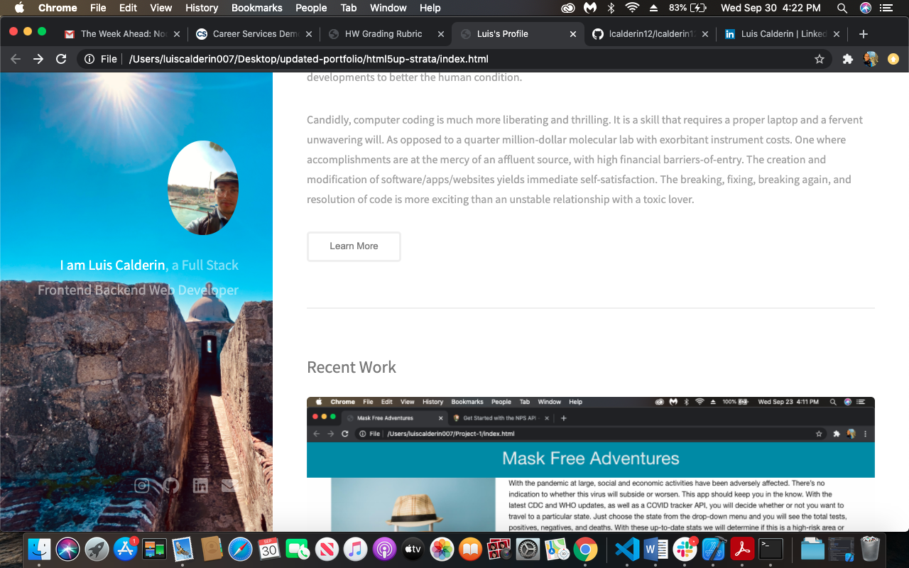
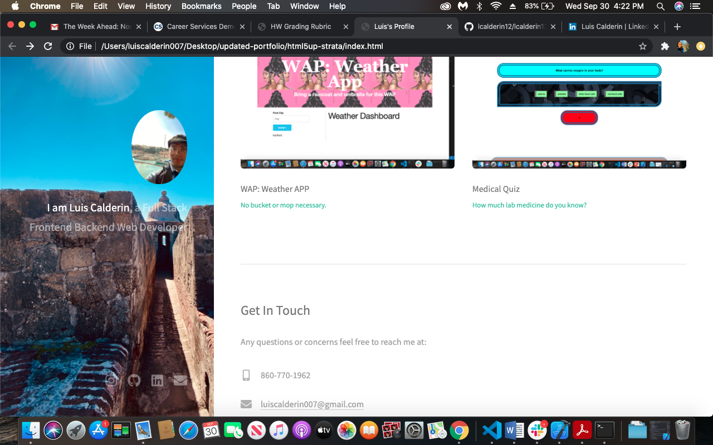

# Overview
Updated portfolio with recent contact information, resume, and favorite projects...
 
When you click on the screenshot it will direct you to the project link. The repo link is right below the image's title. Links to email, linkedIn, github, etc... are all available at your leisure.

## Links
[Repo](https://github.com/lcalderin12/lcalderin12.github.io)
 
[Project](https://lcalderin12.github.io/)
 
## Screenshots

 

